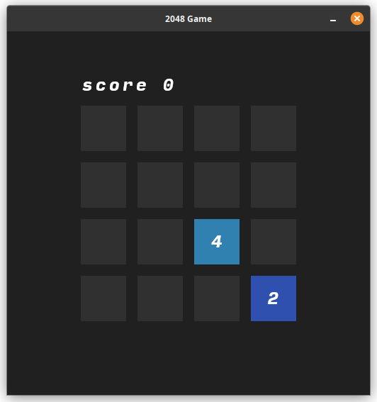
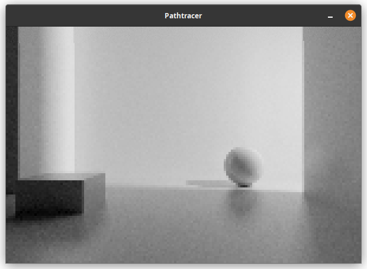

A simple [Zig](https://ziglang.org/) GUI library. Tested and compatible with
with `zig 0.15.2`. Clone and run the examples to start. These work out of the 
box without any additional configuration on Linux or Windows.

```sh
zig run 2048.zig
```



```sh
zig run pathtracer.zig
```



The way it works is very basic:

 1. allocate canvas
 2. paint on it
 3. dump contents to window

There are wrappers for operating systems to get to window and event handling 
as quick as possible, but you're welcome to roll your own. For example you
could load the canvas as a GPU texture and use it as a GUI for an OpenGl 
application.

To use import public functions from [`index.zig`](src/index.zig) This is the
public API surface that we try to keep stable and not to break.

**Project goals:**

- no dependencies required
- no breaking changes

**Planned development:**

- add more examples (games/small tools)
- clean up event handling
- make reusable controls
- adding a wrapper for glfw
- make reusable layout primitives

**Not planned:**

- GPU acceleration
- full unicode support
- custom font support

I know these are dealbreakers for many projects. Go use other frameworks if
these are a requirement for you as these features are probably not happening.

**Optional dependencies:**

Some of the experiments do use some additional libaries. This is not core.
But you may need to manually link additional libs if the build fails.

    zig run 2048.zig -lc -lxcb -lxcb-image

On linux if you used xcb for example you need to insall these:

on Debian

    sudo apt install libxcb1-dev libxcb-image0-dev

on Fedora

    sudo dfn install libxcb-devel xcb-util-image-devel

